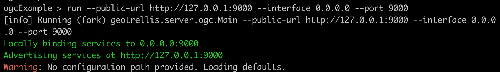

# Starting the Server

This server is initiated through a simple command line interface. There
are four pieces of information the server needs to know before it can
begin serving layers:
1. The local interface on which to bind (defaults to 0.0.0.0)
2. The port on which to listen for requests (defaults to 9000)
3. The publicly advertised URL. Note that this parameter does not affect
   the operation of the server. Rather, it is used by clients to
   determine where requests subsequent to `GetCapabilities` should be
   sent.
4. The path to a file which specifies layer, style, and metadata configurations
   for the layers to be served (defaults to
   [application.conf](../src/main/resources/application.conf))

### Running in SBT

To start the development server (with default configuration provided by
[application.conf](../src/main/resources/application.conf)):

Start SBT
```sh
> ./sbt
```

Navigate to the `ogcExample` project
```sh
root > project ogcExample
```

Fire up the server with some sane defaults for local clients (using 127.0.0.1
for the public URL is fine for development but it is the loopback address
and, as such, will not be visible to clients from another IP):
```sh
ogcExample > run --public-url http://127.0.0.1:9000 --interface 0.0.0.0 --port 9000
```

You should see something like this:


Once initialization is complete, connect to a configured WMS, WCS, or WMTS
service using the URL: `http://localhost:9000`

### Running via Docker Image

This project can produces a Docker image as configured by [`docker.sbt`](docker.sbt).

To generate the image run:

Start SBT
```sh
> ./sbt
```

Navigate to the `ogcExample` project
```sh
ogcExample > docker
```

You should see something like this:
```sh
[info] Assembly up to date: /Users/nzimmerman/git_repos/geotrellis-server/ogc-example/target/scala-2.11/geotrellis-server-ogc-services.jar
[info] Sending build context to Docker daemon  132.3MB
[info] Step 1/3 : FROM openjdk:8-jre
[info]  ---> dd20fb277e3c
[info] Step 2/3 : ADD 0/geotrellis-server-ogc-services.jar /app/geotrellis-server-ogc-services.jar
[info]  ---> Using cache
[info]  ---> 2d343419f914
[info] Step 3/3 : ENTRYPOINT ["java", "-jar", "\/app\/geotrellis-server-ogc-services.jar"]
[info]  ---> Using cache
[info]  ---> bea29613c99e
[info] Successfully built bea29613c99e
[info] Tagging image bea29613c99e with name: geotrellis/geotrellis-server-ogc-services:latest
[info] Tagging image bea29613c99e with name: geotrellis/geotrellis-server-ogc-services:v3.3.0-SNAPSHOT
[success] Total time: 24 s, completed Apr 9, 2019 5:22:39 PM
```

The image can then be run (using default configuration) with:
```sh
docker run --rm -it -e AWS_REGION=us-east-1 -v ~/.aws:/root/.aws -p 9000:9000 geotrellis/geotrellis-server-ogc-services:latest --public-url http://127.0.0.1:9000 --interface 0.0.0.0 --port 9000
```

Referring to a configuration file within the container will, however,
require mounting said configuration (note that the CLI argument refers
to the conf path *inside* the container).
```sh
docker run --rm -it -e AWS_REGION=us-east-1 -v ~/.aws:/root/.aws -v /path/to/myconf.conf:/tmp/myconf.conf -p 9000:9000 geotrellis/geotrellis-server-ogc-services:latest --public-url http://127.0.0.1:9000 --interface 0.0.0.0 --port 9000 --conf /tmp/myconf.conf
```

### Running via jar

SBT is capable of building a jar which can be used directly, given a
java installation. Here's what that looks like:

Using the example conf:
```sh
java -jar geotrellis-server-ogc-services.jar --public-url http://127.0.0.1:9000 --interface 0.0.0.0 --port 9000
```

Using a custom configuration (probably what you want):
```sh
java -jar geotrellis-server-ogc-services.jar --public-url http://127.0.0.1:9000 --interface 0.0.0.0 --port 9000 --conf /path/to/myconf.conf
```

### Logging

Throughout the server, logging statements have been used to keep track
of requests, the resolving of imagery, and other areas in which errors
are likely to pop up or in which code complexity makes reasoning more
difficult. By default, few logs should appear. If increased logging
output is desirable, it can be configured via environment variable.

Turning on Geotrellis Server logging for *all* log levels:
```sh
export GT_OGC_LOG_LEVEL=ALL
```

Extra logging for third party libraries can also be modified:
```sh
# GeoTrellis store logging
export GT_STORE_LOG_LEVEL=DEBUG
# http4s logging
export HTTP4S_LOG_LEVEL=DEBUG
# Blaze server New IO logging
export BLAZE_NIO_LOG_LEVEL=DEBUG
# Amazon SDK logging
export AWS_SDK_LOG_LEVEL=DEBUG
```

> NOTE: If using docker, be sure to set this environment variable
> through the docker CLI upon container creation. It won't automatically
> carry through from the host machine.

Once this environment variable is set, you should be able to run the
server as you would otherwise. Be warned: the server can be *very*
chatty if this setting is changed.

